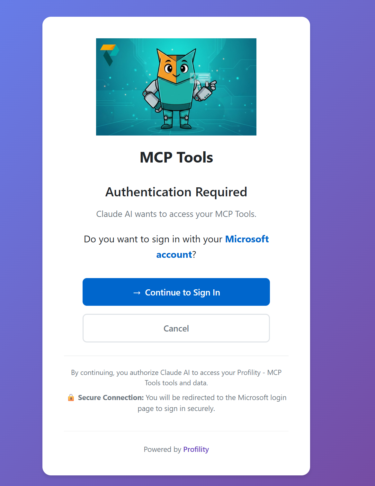

# MCP Server using .Net and Microsoft Entra ID

A .NET boilerplate for building secure MCP servers integrated with Microsoft Entra ID.

This project provides a ready-to-use foundation for anyone who wants to quickly set up a Model Context Protocol (MCP) server that’s secured with Microsoft Entra ID (Azure AD).
It includes all the core components needed to authenticate users from your organization, manage user identity securely, and expose MCP tools in a trusted enterprise environment.

Out of the box, it’s tested and fully compatible with Claude AI, making it the fastest way to get your own Entra-protected MCP server running in minutes.

This project also demonstrates how to bridge the authentication gap between Claude AI and Microsoft Entra ID, ensuring both systems can work together securely and seamlessly.

[](../LICENSE)
[](https://dotnet.microsoft.com/download)

**A .NET 8.0 example implementation showing how to build an OAuth 2.1 proxy that enables Claude AI to authenticate with Microsoft Entra ID for Model Context Protocol (MCP) servers.**

---

## Overview

This project demonstrates how to bridge the authentication gap between Claude AI and Microsoft Entra ID (Azure AD). Claude requires **RFC 7591 Dynamic Client Registration**, which Entra ID doesn't support. This proxy translates between these incompatible systems while maintaining enterprise security.

**Built with the official [Model Context Protocol C# SDK](https://github.com/modelcontextprotocol/csharp-sdk)** - This SDK was a game-changer for implementing MCP servers in .NET, providing strongly-typed interfaces and automatic protocol handling.

```
┌──────────┐      OAuth 2.1       ┌─────────────────┐      OAuth 2.0      ┌────────────┐
│          │  (with Dynamic Reg)  │   OAuth Proxy   │   (Pre-registered)  │            │
│ Claude   ├─────────────────────►│  (This Project) ├────────────────────►│ Entra ID   │
│   AI     │◄─────────────────────┤                 │◄────────────────────┤            │
└──────────┘                      └────────┬────────┘                     └────────────┘
                                           │
                                           │ Validates JWT tokens
                                           ▼
                                  ┌─────────────────┐
                                  │   MCP Server    │
                                  │  (Your Tools)   │
                                  └─────────────────┘
```

### Key Features

- ✅ **Custom Login UI** - Branded consent page before Entra ID authentication
- ✅ **WhoAmI Tool** - Example MCP tool that displays authenticated user information
- ✅ **Dynamic Client Registration** - Implements RFC 7591 for Claude compatibility
- ✅ **Dual PKCE Flows** - Secure authentication between all components (RFC 7636)
- ✅ **Token Mapping** - Opaque external tokens, JWT internal tokens with user claims
- ✅ **User Claims Extraction** - Name, email, OID, UPN from Entra ID tokens
- ✅ **Production Ready** - CORS, HTTPS, error handling, structured logging

### Screenshots

<p align="center">
  
  <br>
  <em>OAuth login flow with custom branding before Entra ID authentication</em>
</p>
*OAuth login flow with custom branding before Entra ID authentication*

### Tested Platforms

**✅ Claude AI** - Fully tested and working with Claude Desktop and web interface

**⚠️ Other MCP Clients** - This proxy implements the MCP OAuth specification. While it may work with other MCP clients, it has **only been tested with Claude AI**. VS Code's MCP integration typically uses direct OAuth with pre-configured client credentials and may not require this proxy

---

## What's Included

### MCP Server with OAuth

This project includes a complete MCP server implementation with:

- **WhoAmI Tool** - Displays authenticated user information
  ```
  ✅ Authentication Status: Authenticated via Entra ID OAuth
  📋 User Information:
    • Name: John Doe
    • Email: john.doe@company.com
    • User ID (OID): b9b8d416-d882-47f9-bb74-445d22ddd735
    • UPN: john.doe@company.com
  ```

- **OAuth Protected Endpoints** - All MCP endpoints require valid Bearer tokens
- **User Context** - Tools can access authenticated user claims for personalization

### OAuth Proxy Components

- **Dynamic Client Registration** - Accepts Claude's registration requests
- **Authorization Flow** - Custom login page + Entra ID redirect
- **Token Exchange** - Maps Entra ID tokens to proxy tokens with correct audience
- **Discovery Endpoints** - RFC 9728 and RFC 8414 compliant metadata

---

## Quick Start

### Prerequisites

- ✅ .NET 8.0 SDK installed
- ✅ Azure subscription with Entra ID tenant
- ✅ Admin access to create App Registrations
- ✅ Visual Studio 2022, VS Code, or Rider

**Note**: This project uses the official **[MCP C# SDK](https://github.com/modelcontextprotocol/csharp-sdk)** which simplifies MCP server implementation significantly.

### 1. Clone and Build

```powershell
git clone <your-repo-url>
cd MCP
dotnet build
```

### 2. Azure App Registration Setup

1. Go to **Azure Portal** > **Entra ID** > **App registrations** > **New registration**

2. Configure the app:
   - **Name**: `MCP OAuth Proxy`
   - **Supported account types**: `Accounts in this organizational directory only`
   - **Redirect URI**: `Web` - `https://YOUR-DOMAIN/oauth/callback`
     - For production: Use your deployed URL (e.g., `https://your-app.azurewebsites.net/oauth/callback`)
     - For DevTunnels: Use your tunnel URL (e.g., `https://abc123-5248.euw.devtunnels.ms/oauth/callback`)

3. After creation, note the following values:
   - **Application (client) ID**
   - **Directory (tenant) ID**

4. Create a client secret:
   - Go to **Certificates & secrets** > **New client secret**
   - **Description**: `MCP Proxy Secret`
   - **Expires**: Choose appropriate duration
   - **Copy the secret value** (shown only once)

5. Configure API permissions:
   - Go to **API permissions** > **Add a permission**
   - Select **Microsoft Graph** > **Delegated permissions**
   - Add: `openid`, `profile`, `email`, `User.Read`
   - Click **Grant admin consent**
   
   **Note**: `User.Read` is not strictly required for basic authentication, but is commonly used and enables future scenarios where you might need to call Microsoft Graph API (e.g., to fetch user photos, calendar data, etc.).

6. Expose an API (for token audience):
   - Go to **Expose an API** > **Add a scope**
   - **Application ID URI**: `api://YOUR-CLIENT-ID` (default is fine)
   - **Scope name**: `MCP.Access`
   - **Who can consent**: `Admins and users`
   - **Admin consent display name**: `Access MCP Server`
   - **Admin consent description**: `Allows the application to access MCP tools on your behalf`

### 3. Generate Security Keys

Run the key generation script:

```powershell
.\GenerateKeys.ps1
```

Copy the generated values to your configuration.

### 4. Configure appsettings.json

```json
{
  "MCP": {
    "ServerUrl": "https://YOUR-DOMAIN"
  },
  "AzureAd": {
    "Instance": "https://login.microsoftonline.com/",
    "TenantId": "YOUR-TENANT-ID",
    "ClientId": "YOUR-CLIENT-ID",
    "ClientSecret": "YOUR-CLIENT-SECRET",
    "Scope": "api://YOUR-CLIENT-ID/MCP.Access"
  },
  "Jwt": {
    "SigningKey": "GENERATED-SIGNING-KEY",
    "EncryptionKey": "GENERATED-ENCRYPTION-KEY",
    "ExpirationMinutes": "60"
  }
}
```

**Important**: 
- Replace `YOUR-DOMAIN` with your actual domain (e.g., `https://your-app.azurewebsites.net`)
- For local development with DevTunnels, use your tunnel URL (e.g., `https://abc123-5248.euw.devtunnels.ms`) - see step 6 below
- Replace `YOUR-TENANT-ID`, `YOUR-CLIENT-ID`, `YOUR-CLIENT-SECRET` with values from Azure App Registration
- Use the keys generated by `GenerateKeys.ps1` for `SigningKey` and `EncryptionKey`

### 5. Run the Server

```powershell
dotnet run
```

The server will start at `https://localhost:5248` (or your configured port).

### 6. Local Development with DevTunnels (Optional)

For local testing with Claude AI, you can use Microsoft DevTunnels to expose your local server:

```powershell
# 1. Install Dev Tunnels CLI (one-time setup)
winget install Microsoft.devtunnel

# 2. Verify installation
devtunnel --version

# 3. Log in (one-time setup for tunnel management)
devtunnel user login

# 4. Create a persistent tunnel with anonymous access
devtunnel create -a

# 5. Map your local HTTPS app on port 5248 to the tunnel
devtunnel port create -p 5248 --protocol https

# 6. Start the tunnel
devtunnel host
```

**After starting the tunnel:**
- Use the **"Connect via browser:"** URL as your `MCP:ServerUrl` in `appsettings.json`
- Add this URL as a redirect URI in your Entra ID app registration (`https://YOUR-TUNNEL-URL.devtunnels.ms/oauth/callback`)
- Use this URL when configuring Claude AI
- The **"Inspect network activity:"** URL can be used to monitor traffic between Claude and your MCP server

**Example DevTunnel URL:** `https://abc123-5248.euw.devtunnels.ms`

### 7. Configure Claude AI

1. Open **Claude Desktop** or go to **claude.ai**
2. Navigate to **Settings** > **Connections** (or equivalent)
3. Click **Add Integration** or **Add Custom Connector**
4. Enter your server URL: `https://YOUR-DOMAIN` (or your DevTunnel URL for local testing)
5. Click **Connect**
6. You'll be redirected to the login page, then Entra ID
7. After authentication, you'll see ✅ **Connected** in Claude

### 8. Test the Connection

In Claude, try:
```
Use the WhoAmI tool to show my information
```

You should see your name, email, and other claims from Entra ID.

---

## Project Structure

```
MCP/
├── Controllers/
│   ├── OAuthController.cs          # OAuth endpoints (authorize, continue, cancel, callback, token, register)
│   └── WellKnownController.cs      # Discovery endpoints
├── Services/
│   ├── PkceStateManager.cs         # Encrypted state for PKCE flows
│   ├── InMemoryTokenStore.cs       # Token mappings
│   ├── InMemoryLoginTokenStore.cs  # Login page tokens
│   ├── InMemoryClientStore.cs      # Client registrations
│   ├── ProxyJwtTokenGenerator.cs   # JWT generation with correct claims
│   └── BrandingProvider.cs         # Branding configuration provider
├── Models/
│   ├── PkceStateData.cs            # PKCE state data
│   ├── TokenMapping.cs             # Token mapping data
│   ├── LoginTokenData.cs           # Login page data
│   ├── ClientMapping.cs            # Client registration data
│   └── LoginPageModel.cs           # Login page view model
├── Tools/
│   └── WhoAmITool.cs               # Example MCP tool
├── Views/Login/
│   └── Index.cshtml                # Custom login UI
├── wwwroot/css/
│   └── login.css                   # Login page styling
├── Program.cs                       # ASP.NET Core configuration
├── appsettings.json                # Configuration
├── GenerateKeys.ps1                # Key generation script
├── README.md                        # This file
└── README-Architecture.md           # Technical architecture details
```

---

## Authentication Flow

```
1. Claude → GET /.well-known/oauth-protected-resource
           Discovers authorization server

2. Claude → POST /oauth/register
           Dynamic client registration
           ← Returns client_id

3. Claude → GET /oauth/authorize?client_id=...&code_challenge=...
           Starts authorization flow
           ← Shows custom login page with user consent
           [User clicks "Continue"]

4. Proxy  → POST /oauth/continue
           Redirects to https://login.microsoftonline.com/.../authorize
           User authenticates with Entra ID

5. Entra  → Redirects to /oauth/callback?code=...
           Authorization code returned

6. Proxy  → Exchanges code with Entra ID
           ← Receives access_token + id_token

7. Proxy  → Generates proxy authorization code
           Redirects to https://claude.ai/api/mcp/auth_callback?code=...

8. Claude → POST /oauth/token (with code_verifier)
           Exchanges code for token
           ← Receives opaque access_token

9. Claude → GET /mcp/v1/tools (with Authorization: Bearer ...)
            Proxy validates token, forwards with JWT
            ← MCP server processes request
```

See [README-Architecture.md](README-Architecture.md) for detailed technical documentation.

---

## Customization

### Branding

The login page can be customized with your own branding via `appsettings.json`:

```json
"Branding": {
  "CompanyName": "Profility",
  "ProductName": "Profility MCP Server",
  "PrimaryColor": "#6B46C1",
  "PrimaryHoverColor": "#553C9A"
}
```

This allows you to:
- **CompanyName**: Your organization name (displayed in text)
- **ProductName**: Your product/service name (page title and descriptions)
- **PrimaryColor**: Main brand color in hex format (logo, buttons)
- **PrimaryHoverColor**: Darker shade for button hover states

Branding is configured through `appsettings.json` - no code changes needed!


---

## Troubleshooting

### "Invalid client_id" error
- Verify `AzureAd:ClientId` matches Azure App Registration
- Check redirect URI is configured in Azure

### "Invalid code_verifier" error
- Indicates PKCE validation failed
- Check that Data Protection keys are consistent across restarts
- Verify `Jwt:EncryptionKey` is configured

### "Invalid audience" error
- Ensure JWT `aud` claim matches MCP server URL
- Verify `Jwt:Audience` configuration

### Token expires immediately
- Check system clock synchronization
- Verify token lifetime configuration

### User claims missing
- Ensure `openid profile email` scopes are in token request
- Check Entra ID API permissions are granted
- Verify admin consent was provided

For more troubleshooting, see logs at `Information` level.

---

## Security Considerations

⚠️ **Production Deployment Checklist**:

- [ ] Use HTTPS with valid TLS certificates
- [ ] Store secrets in Azure Key Vault or similar
- [ ] Implement rate limiting on OAuth endpoints
- [ ] Enable CORS only for trusted origins
- [ ] Use persistent Data Protection key storage (not in-memory)
- [ ] **Replace in-memory caches with persistent storage** (Redis/SQL Server)
- [ ] Implement token revocation
- [ ] Monitor for suspicious authentication patterns
- [ ] Regular security updates and dependency scanning
- [ ] Implement proper error handling (no sensitive data in errors)
- [ ] Use short token lifetimes (1 hour recommended)

### ⚠️ Current Limitations

This reference implementation uses **in-memory caching** for simplicity:
- **PKCE State** - Stored in `IMemoryCache`
- **Token Mappings** - Stored in `IMemoryCache`
- **Client Registrations** - Stored in `IMemoryCache`

**For production deployments**, you should replace these with:
- ✅ **Redis** - Distributed cache for web farms (recommended)
- ✅ **SQL Server** - Persistent storage with audit trail
- ✅ **Azure Table Storage** - Cost-effective cloud storage


---

## Documentation

- **[Architecture](README-Architecture.md)** - Technical details, OAuth flows, PKCE implementation

---

## Contributing

Contributions are welcome! This project serves as a reference implementation for MCP OAuth integration with enterprise identity providers.

### Areas for Improvement

- Additional OAuth provider implementations (Google, Okta, etc.)
- Additional tools like ChatGTP
- Redis/SQL token storage for production scale
- Token refresh implementation
- More sample MCP tools
- Automated testing

---

## License

MIT License - See LICENSE file for details

---

## Acknowledgments

- **Anthropic** - For the MCP specification and Claude AI
- **[Model Context Protocol C# SDK](https://github.com/modelcontextprotocol/csharp-sdk)** - Official .NET implementation that made this project possible
- **Microsoft** - For Entra ID and excellent OAuth documentation
- **Community** - For OAuth 2.1, PKCE, and related RFCs

---

## Maintainers & Contributors

- Ronny Vander Snickt — Profility (https://profility.be)

Interested in contributing? See the Contributing section above or open a pull request.

---

## Support

This is a reference implementation. For issues:
1. Check the troubleshooting section above
2. Review [README-Architecture.md](README-Architecture.md) for technical details
3. Open an issue with logs and configuration (redact secrets!)

---

**Built with ❤️ as an example of enterprise MCP OAuth integration**

