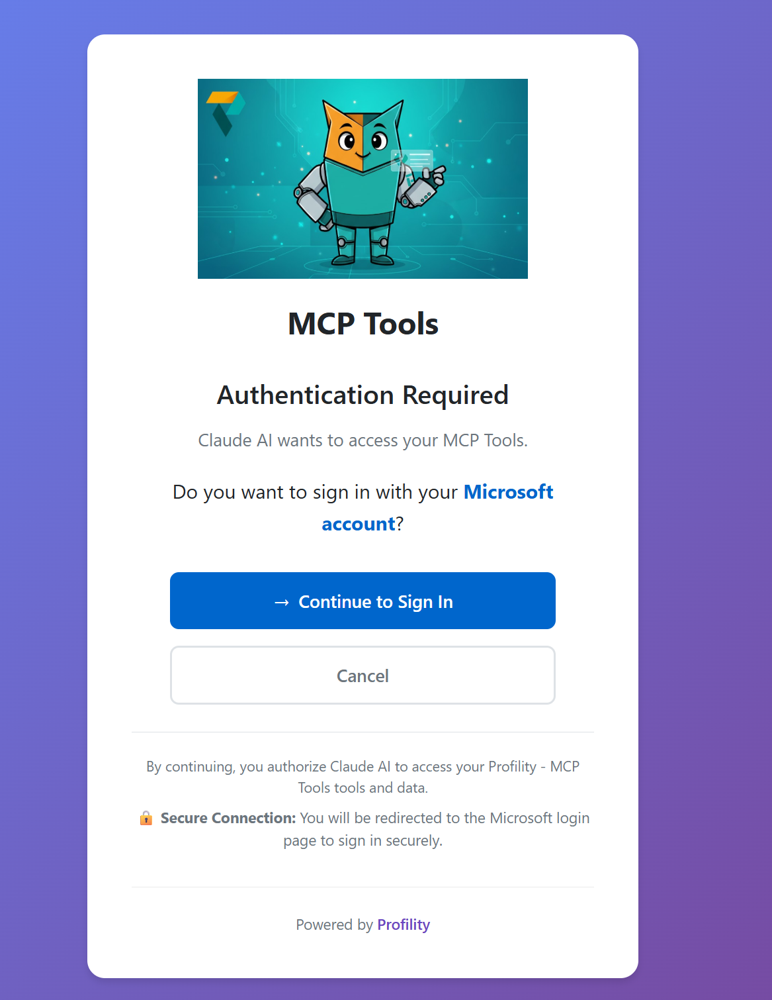

# MCP Server using .Net and Microsoft Entra ID

A .NET boilerplate for building secure MCP servers integrated with Microsoft Entra ID.

This project provides a ready-to-use foundation for anyone who wants to quickly set up a Model Context Protocol (MCP) server that’s secured with Microsoft Entra ID (Azure AD).
It includes all the core components needed to authenticate users from your organization, manage user identity securely, and expose MCP tools in a trusted enterprise environment.

Out of the box, it’s tested and compatible with Claude AI and ChatGPT, making it the fastest way to get your own Entra-protected MCP server running in minutes.

This project demonstrates how to bridge the authentication gap between MCP clients (Claude AI, ChatGPT) and Microsoft Entra ID, ensuring these systems can work together securely and seamlessly.

[](../LICENSE)
[](https://dotnet.microsoft.com/download)
[](https://github.com/modelcontextprotocol/csharp-sdk)

**A .NET 10 example implementation showing how to build an OAuth 2.1 proxy that enables Claude AI to authenticate with Microsoft Entra ID for Model Context Protocol (MCP) servers.**

> ### 📦 Cloned this before? Read [UPGRADING.md](UPGRADING.md)
>
> This project moved from **.NET 8 + MCP C# SDK 0.4.0-preview.2** to **.NET 10 + MCP C# SDK 2.2.0**.
> The SDK API is source-compatible, but three behaviours changed: tools are now named in
> `lower_snake_case` (`WhoAmI` → `who_am_i`), the HTTP transport is **stateless by default** (no
> `/sse`, no sampling or elicitation), and protected-resource metadata is now served by the SDK.
> [UPGRADING.md](UPGRADING.md) explains each change, how to switch the old behaviour back on with a
> single setting, and what deliberately did *not* change.

---

## Overview

This project demonstrates how to bridge the authentication gap between Claude AI and Microsoft Entra ID (Azure AD). Claude requires **RFC 7591 Dynamic Client Registration**, which Entra ID doesn't support. This proxy translates between these incompatible systems while maintaining enterprise security.

**Built with the official [Model Context Protocol C# SDK](https://github.com/modelcontextprotocol/csharp-sdk)** - This SDK was a game-changer for implementing MCP servers in .NET, providing strongly-typed interfaces and automatic protocol handling.

```
┌──────────┐      OAuth 2.1       ┌──────────────────────┐      OAuth 2.0      ┌────────────┐
│          │  (with Dynamic Reg)  │                      │   (Pre-registered)  │            │
│ Claude   ├─────────────────────►│  MCP (OAuth) Server  ├────────────────────►│ Entra ID   │
│   AI     │◄─────────────────────┤   (this project)     │◄────────────────────┤            │
└──────────┘                      └──────────────────────┘                     └────────────┘
                                  
```

### Key Features

- ✅ **Custom Login UI** - Branded consent page before Entra ID authentication
- ✅ **WhoAmI Tool** - Example MCP tool that displays authenticated user information
- ✅ **Dynamic Client Registration** - Implements RFC 7591 for Claude compatibility
- ✅ **Dual PKCE Flows** - Secure authentication between all components (RFC 7636)
- ✅ **Token Mapping** - Opaque external tokens, JWT internal tokens with user claims
- ✅ **User Claims Extraction** - Name, email, OID, UPN from Entra ID tokens
- ✅ **Production Ready** - CORS, HTTPS, error handling, structured logging

### Screenshots

<p align="center">
  
  <br>
  <em>OAuth login flow with custom branding before Entra ID authentication</em>
</p>
*OAuth login flow with custom branding before Entra ID authentication*

### Tested Platforms

**✅ Claude AI** - Fully tested and working with Claude Desktop and web interface

**✅ ChatGPT** - Tested and working; see Troubleshooting for notes about Dynamic Client Registration and persistent client storage requirements.

**⚠️ Other MCP Clients** - This proxy implements the MCP OAuth specification. While it may work with other MCP clients, it has primarily been tested with Claude AI and ChatGPT. VS Code's MCP integration typically uses direct OAuth with pre-configured client credentials and may not require this proxy

---

## What's Included

### MCP Server with OAuth

This project includes a complete MCP server implementation with:

- **`who_am_i` Tool** - Displays authenticated user information, deliberately kept as a small,
  readable example:
  ```
  Authenticated via Entra ID OAuth.

  Name:  John Doe
  Email: john.doe@company.com
  OID:   b9b8d416-d882-47f9-bb74-445d22ddd735
  UPN:   john.doe@company.com
  Token expires: 2026-08-26 16:25:03Z (789s left)

  Claims (11 shown, 6 withheld):
    ...
  ```
  It reads the caller from `RequestContext<CallToolRequestParams>.User` rather than
  `IHttpContextAccessor`, which is correct in every session mode - in a stateful session the tool
  runs after the originating HTTP request has already completed.

- **Claim allowlisting** - The tool echoes back only claims on an explicit allowlist, never a
  denylist. A denylist leaks every claim that Entra ID or your own `IClaimProvider` adds later; an
  allowlist means new claims stay invisible until you opt them in. A 256-character value cap backs it
  up so nothing token-shaped slips through, and withheld claims are reported as a count only. Note
  that JwtBearer maps some claims to the long `ClaimTypes` URI (`email`, `upn`, `oid`, `tid`) and
  leaves others short (`name`, `scope`, `iss`) - list both spellings when you extend the allowlist,
  or your claim is silently dropped.

- **OAuth Protected Endpoints** - All MCP endpoints require valid Bearer tokens
- **Per-tool authorization** - `AddAuthorizationFilters()` honours `[Authorize]` on individual tools
  and filters `tools/list` per user
- **User Context** - Tools can access authenticated user claims for personalization

### OAuth Proxy Components

- **Dynamic Client Registration** - Accepts Claude's registration requests
- **Authorization Flow** - Custom login page + Entra ID redirect
- **Token Exchange** - Maps Entra ID tokens to proxy tokens with correct audience
- **Discovery Endpoints** - RFC 9728 and RFC 8414 compliant metadata

---

## Quick Start

### Prerequisites

- ✅ .NET 10 SDK installed
- ✅ Azure subscription with Entra ID tenant
- ✅ Admin access to create App Registrations
- ✅ Visual Studio 2022, VS Code, or Rider

**Note**: This project uses the official **[MCP C# SDK](https://github.com/modelcontextprotocol/csharp-sdk)** which simplifies MCP server implementation significantly.

### 1. Clone and Build

```powershell
git clone <your-repo-url>
cd MCP
dotnet build
```

### 2. Azure App Registration Setup

1. Go to **Azure Portal** > **Entra ID** > **App registrations** > **New registration**

2. Configure the app:
   - **Name**: `MCP OAuth Proxy`
   - **Supported account types**: `Accounts in this organizational directory only`
   - **Redirect URI**: `Web` - `https://YOUR-DOMAIN/oauth/callback`
     - For production: Use your deployed URL (e.g., `https://your-app.azurewebsites.net/oauth/callback`)
     - For DevTunnels: Use your tunnel URL (e.g., `https://abc123-5248.euw.devtunnels.ms/oauth/callback`)

3. After creation, note the following values:
   - **Application (client) ID**
   - **Directory (tenant) ID**

4. Create a client secret:
   - Go to **Certificates & secrets** > **New client secret**
   - **Description**: `MCP Proxy Secret`
   - **Expires**: Choose appropriate duration
   - **Copy the secret value** (shown only once)

5. Configure API permissions:
   - Go to **API permissions** > **Add a permission**
   - Select **Microsoft Graph** > **Delegated permissions**
   - Add: `openid`, `profile`, `email`, `User.Read`
   - Click **Grant admin consent**
   
   **Note**: `User.Read` is not strictly required for basic authentication, but is commonly used and enables future scenarios where you might need to call Microsoft Graph API (e.g., to fetch user photos, calendar data, etc.).

6. Expose an API (for token audience):
   - Go to **Expose an API** > **Add a scope**
   - **Application ID URI**: `api://YOUR-CLIENT-ID` (default is fine)
   - **Scope name**: `MCP.Access`
   - **Who can consent**: `Admins and users`
   - **Admin consent display name**: `Access MCP Server`
   - **Admin consent description**: `Allows the application to access MCP tools on your behalf`

### 3. Generate Security Keys

Run the key generation script:

```powershell
.\GenerateKeys.ps1
```

Copy the generated values to your configuration.

### 4. Configure appsettings.json

```json
{
  "MCP": {
    "ServerUrl": "https://YOUR-DOMAIN",
    "SessionMode": "Stateless",
    "EnableLegacySse": false
  },
  "AzureAd": {
    "Instance": "https://login.microsoftonline.com/",
    "TenantId": "YOUR-TENANT-ID",
    "ClientId": "YOUR-CLIENT-ID",
    "ClientSecret": "YOUR-CLIENT-SECRET",
    "Scope": "api://YOUR-CLIENT-ID/MCP.Access"
  },
  "Jwt": {
    "SigningKey": "GENERATED-SIGNING-KEY",
    "EncryptionKey": "GENERATED-ENCRYPTION-KEY",
    "ExpirationMinutes": "60"
  },
  "TokenStore": {
    "Provider": "InMemory",
    "AzureTableStorage": {
      "ConnectionString": "DefaultEndpointsProtocol=https;AccountName=YOUR_ACCOUNT;AccountKey=YOUR_KEY;EndpointSuffix=core.windows.net",
      "TableName": "TokenMappings"
    }
  },
  "ClientStore": {
    "Provider": "InMemory",
    "AzureTableStorage": {
      "ConnectionString": "DefaultEndpointsProtocol=https;AccountName=YOUR_ACCOUNT;AccountKey=YOUR_KEY;EndpointSuffix=core.windows.net",
      "TableName": "ClientRegistrations"
    }
  }
}
```

**Important**: 
- Replace `YOUR-DOMAIN` with your actual domain (e.g., `https://your-app.azurewebsites.net`)
- For local development with DevTunnels, use your tunnel URL (e.g., `https://abc123-5248.euw.devtunnels.ms`) - see step 6 below
- Replace `YOUR-TENANT-ID`, `YOUR-CLIENT-ID`, `YOUR-CLIENT-SECRET` with values from Azure App Registration
- Use the keys generated by `GenerateKeys.ps1` for `SigningKey` and `EncryptionKey`

**MCP Transport Options**:

The MCP endpoint is mapped at the application root using the Streamable HTTP transport.

- **`SessionMode`** - `Stateless` (default), `StatefulForInitializeClients`, or `Stateful`.
  `Stateless` is the SDK 2.x default and the right choice for a new server: no `Mcp-Session-Id`, so
  the app scales out without session affinity. The trade-off is that the server cannot send requests
  to the client, so **sampling, elicitation and roots are unavailable**, and the `/sse` endpoint does
  not exist. Pick `StatefulForInitializeClients` if you have older clients that need a real session —
  modern clients keep being served statelessly on the same endpoint.
- **`EnableLegacySse`** - `false` (default). Maps the deprecated `/sse` and `/message` endpoints for
  pre-Streamable-HTTP clients. Requires a stateful `SessionMode`. Off by default because legacy SSE
  has no HTTP-level backpressure.

The active mode is printed at startup, which is the fastest way to confirm your configuration:

```
info: MCP[0] MCP session mode: Stateless (legacy SSE: False)
```

See [UPGRADING.md](UPGRADING.md) for the full comparison and migration guidance.

**Token Storage Options**:
- **`InMemory`** (default) - Uses in-memory storage, suitable for development and single-instance deployments
- **`AzureTableStorage`** - Uses Azure Table Storage for persistent, scalable token storage across multiple instances
  - Configure `ConnectionString` with your Azure Storage account connection string
  - `TableName` defaults to `TokenMappings` if not specified
  - Automatically creates the table on startup
  - Expired tokens (>90 days) are cleaned up on each application restart

**Client Storage Options**:
- **`InMemory`** (default) - Uses deterministic client IDs (SHA-256 hash), suitable for development
- **`AzureTableStorage`** - Uses Azure Table Storage for persistent client registrations
  - Configure `ConnectionString` with your Azure Storage account connection string
  - `TableName` defaults to `ClientRegistrations` if not specified
  - Uses random GUIDs for client IDs
  - **Required for ChatGPT** - ChatGPT only registers once and expects persistent client IDs

### 5. Run the Server

```powershell
dotnet run
```

The server will start at `https://localhost:5248` (or your configured port).

### 6. Local Development with DevTunnels (Optional)

For local testing with Claude AI, you can use Microsoft DevTunnels to expose your local server:

```powershell
# 1. Install Dev Tunnels CLI (one-time setup)
winget install Microsoft.devtunnel

# 2. Verify installation
devtunnel --version

# 3. Log in (one-time setup for tunnel management)
devtunnel user login

# 4. Create a persistent tunnel with anonymous access
devtunnel create -a

# 5. Map your local HTTPS app on port 5248 to the tunnel
devtunnel port create -p 5248 --protocol https

# 6. Start the tunnel
devtunnel host
```

**After starting the tunnel:**
- Use the **"Connect via browser:"** URL as your `MCP:ServerUrl` in `appsettings.json`
- Add this URL as a redirect URI in your Entra ID app registration (`https://YOUR-TUNNEL-URL.devtunnels.ms/oauth/callback`)
- Use this URL when configuring Claude AI
- The **"Inspect network activity:"** URL can be used to monitor traffic between Claude and your MCP server

**Example DevTunnel URL:** `https://abc123-5248.euw.devtunnels.ms`

### 7. Configure Claude AI

1. Open **Claude Desktop** or go to **claude.ai**
2. Navigate to **Settings** > **Connections** (or equivalent)
3. Click **Add Integration** or **Add Custom Connector**
4. Enter your server URL: `https://YOUR-DOMAIN` (or your DevTunnel URL for local testing)
5. Click **Connect**
6. You'll be redirected to the login page, then Entra ID
7. After authentication, you'll see ✅ **Connected** in Claude

### 8. Test the Connection

In Claude, try:
```
Use the WhoAmI tool to show my information
```

You should see your name, email, and other claims from Entra ID.

---

## Project Structure

```
MCP/
├── Controllers/
│   ├── OAuthController.cs          # OAuth endpoints (authorize, continue, cancel, callback, token, register)
│   └── WellKnownController.cs      # Authorization-server metadata (RFC 8414). Protected-resource
│                                   #   metadata (RFC 9728) is configured in Program.cs instead.
├── Services/
│   ├── PkceStateManager.cs         # Encrypted state for PKCE flows
│   ├── InMemoryLoginTokenStore.cs  # Short-lived login page tokens
│   ├── BrandingProvider.cs         # Branding configuration provider
│   ├── ConfigurationHelper.cs      # Configuration helper utilities
│   ├── ClientStore/
│   │   ├── AzureTableClientStore.cs # Azure Table Storage client store
│   │   ├── InMemoryClientStore.cs  # In-memory client store for development
│   │   └── IClientStore.cs         # Client store interface
│   ├── Jwt/
│   │   ├── DefaultClaimProvider.cs # Default JWT claim provider
│   │   ├── IClaimProvider.cs       # Interface for claim providers
│   │   ├── JwtBuilder.cs           # JWT token building utilities
│   │   └── SampleClaimProvider.cs  # Sample implementation of claim provider
│   └── TokenStore/
│       ├── AzureTableTokenStore.cs # Azure Table Storage token store
│       ├── InMemoryTokenStore.cs   # In-memory token store for development
│       └── ITokenStore.cs          # Token store interface
├── Models/
│   ├── PkceStateData.cs            # PKCE state data
│   ├── TokenData.cs                # Unified token model (authorization_code + refresh_token)
│   ├── LoginTokenData.cs           # Login page data
│   ├── ClientMapping.cs            # Client registration data
│   └── LoginPageModel.cs           # Login page view model
├── Tools/
│   └── WhoAmITool.cs               # Example MCP tool (exposed as who_am_i)
├── Views/
│   ├── _ViewImports.cshtml         # Razor view imports
│   └── Login/
│       └── Index.cshtml            # Custom login UI
├── wwwroot/css/
│   └── login.css                   # Login page styling
├── Properties/
│   ├── launchSettings.json         # Launch settings for development
│   └── PublishProfiles/            # Publish profiles
├── Program.cs                      # ASP.NET Core configuration
├── appsettings.json                # Configuration
├── appsettings.Development.json    # Development configuration
├── MCP.csproj                      # Project file
├── GenerateKeys.ps1                # Key generation script
├── README.md                       # This file
├── README-Architecture.md          # Technical architecture details
└── UPGRADING.md                    # .NET 10 / MCP SDK 2.2.0 migration notes
```

---

## Authentication Flow

```
1. Claude → GET /.well-known/oauth-protected-resource
           Discovers authorization server

2. Claude → POST /oauth/register
           Dynamic client registration
           ← Returns client_id

3. Claude → GET /oauth/authorize?client_id=...&code_challenge=...
           Starts authorization flow
           ← Shows custom login page with user consent
           [User clicks "Continue"]

4. Proxy  → POST /oauth/continue
           Redirects to https://login.microsoftonline.com/.../authorize
           User authenticates with Entra ID

5. Entra  → Redirects to /oauth/callback?code=...
           Authorization code returned

6. Proxy  → Exchanges code with Entra ID
           ← Receives access_token + id_token

7. Proxy  → Generates proxy authorization code
           Redirects to https://claude.ai/api/mcp/auth_callback?code=...

8. Claude → POST /oauth/token (with code_verifier)
           Exchanges code for token
           ← Receives opaque access_token

9. Claude → GET /mcp/v1/tools (with Authorization: Bearer ...)
            Proxy validates token, forwards with JWT
            ← MCP server processes request
```

See [README-Architecture.md](README-Architecture.md) for detailed technical documentation.

---

## Customization

### Branding

The login page can be customized with your own branding via `appsettings.json`:

```json
"Branding": {
  "CompanyName": "Profility",
  "ProductName": "Profility MCP Server",
  "PrimaryColor": "#6B46C1",
  "PrimaryHoverColor": "#553C9A"
}
```

This allows you to:
- **CompanyName**: Your organization name (displayed in text)
- **ProductName**: Your product/service name (page title and descriptions)
- **PrimaryColor**: Main brand color in hex format (logo, buttons)
- **PrimaryHoverColor**: Darker shade for button hover states

Branding is configured through `appsettings.json` - no code changes needed!

### Custom Claims

The JWT tokens issued to Claude can be extended with custom claims through the claim provider system. This allows you to add organization-specific or application-specific claims to the tokens.

**How it works:**
- Implement the `IClaimProvider` interface in `MCP/Services/Jwt/`
- Register your provider in `Program.cs` alongside the default providers
- Claims are added in registration order, enabling chaining between providers

See for more info README-Architecture.md

---

## Troubleshooting

### "Invalid client_id" error
- Verify `AzureAd:ClientId` matches Azure App Registration
- Check redirect URI is configured in Azure

### "Invalid code_verifier" error
- Indicates PKCE validation failed
- Check that Data Protection keys are consistent across restarts
- Verify `Jwt:EncryptionKey` is configured

### "Invalid audience" error
- Ensure JWT `aud` claim matches MCP server URL
- Verify `Jwt:Audience` configuration

### Token expires immediately
- Check system clock synchronization
- Verify token lifetime configuration

### User claims missing
- Ensure `openid profile email` scopes are in token request
- Check Entra ID API permissions are granted
- Verify admin consent was provided


### ChatGTP Issue: `invalid_client` after restarting the MCP service
When the MCP service is restarted, ChatGPT may display the following error during the OAuth flow:

```
{
"error": "invalid_client",
"error_description": "Client not found"
}

```

**Cause:**
This happens because **Dynamic Client Registration (DCR)** behaves differently between clients:

- **Claude AI** automatically re-registers itself whenever the application restarts.  
- **ChatGPT** only performs DCR **once**, at the moment the connector is added.  
  After that, ChatGPT expects the `client_id` to remain valid indefinitely.

If the MCP server stores registered clients **in-memory**, a restart clears the client registry and ChatGPT continues sending an old `client_id` that no longer exists — resulting in `invalid_client`.

**Solution:**
Use a **persistent client store** instead of an in-memory store when testing with ChatGPT:

```json
"ClientStore": {
  "Provider": "AzureTableStorage",
  "AzureTableStorage": {
    "ConnectionString": "DefaultEndpointsProtocol=https;...",
    "TableName": "ClientRegistrations"
  }
}
```

This ensures the registered `client_id` survives application restarts and prevents the OAuth handshake from failing.

### ChatGTP Issue: “Connector is not safe” error
**Problem description:**
When connecting the custom MCP server in ChatGPT, the connection initially appeared successful.  
The connector showed as **connected**, but **no tools were available**.  
Refreshing the tools (Developer Tools → Network) revealed an API response:
```

{ "detail": "Connector is not safe" }

```

This issue was **not** caused by the MCP server, authentication flow, devtunnels, or Entra ID.  Instead, ChatGPT rejected the connector during its **safety evaluation phase**, which scans the tool metadata (name + description) for anything suggesting access to **personal data** (PII).

Even though the server was fully secure, the original tool description explicitly mentioned  
**“name, email, ID”**, which triggered ChatGPT’s safety heuristics and caused it to block the connector.

**Cause:**
ChatGPT flags a connector as “not safe” if any tool description implies it retrieves **user identity**, **email**, **personal information**, or other sensitive data — regardless of whether the connector is private or trusted.
The safety check operates purely on **tool metadata**, not on your actual implementation.

**Solution:**
Rewrite the tool description to avoid explicit references to personal information.  
The tool may still return full identity details internally — the scan only evaluates the metadata text.

**Example:**
Original unsafe description:
```
Get information about the currently authenticated user (name, email, ID, etc.)
```
New safe description:
```
Returns basic operational context about the authenticated session.
```

## Security Considerations

⚠️ **Production Deployment Checklist**:

- [ ] Use HTTPS with valid TLS certificates
- [ ] Store secrets in Azure Key Vault or similar
- [ ] Implement rate limiting on OAuth endpoints
- [ ] Enable CORS only for trusted origins
- [ ] Use persistent Data Protection key storage (not in-memory)
- [ ] **Use Azure Table Storage for token persistence** (included, see TokenStore config)
- [ ] Implement token revocation
- [ ] Monitor for suspicious authentication patterns
- [ ] Regular security updates and dependency scanning
- [ ] Implement proper error handling (no sensitive data in errors)
- [ ] Use short token lifetimes (1 hour recommended)

### ⚠️ Current Limitations

This reference implementation uses **in-memory storage** by default for simplicity:
- **PKCE State** - Stored in a static `ConcurrentDictionary` (in-memory)
- **Token Mappings** - Configurable: `InMemory` (default) or `AzureTableStorage`
- **Client Registrations** - Configurable: `InMemory` (default) or `AzureTableStorage`
- **Login Tokens** - Stored in a static `ConcurrentDictionary` (in-memory)

**For production deployments**, use Azure Table Storage for persistence:
- ✅ **Azure Table Storage for Tokens** - Production-ready token storage included
  - Set `TokenStore:Provider` to `AzureTableStorage` in appsettings.json
  - Automatic table creation on startup
  - Expired token cleanup (>90 days) on application restart
- ✅ **Azure Table Storage for Clients** - Production-ready client storage included
  - Set `ClientStore:Provider` to `AzureTableStorage` in appsettings.json
  - **Required for ChatGPT** compatibility (persistent client IDs)
  - Uses random GUIDs instead of deterministic hashing
- ✅ **Redis** - Alternative for distributed cache (not included, see Architecture docs)
- ✅ **SQL Server** - Alternative for audit trail requirements (not included, see Architecture docs)

---

## Documentation

- **[Architecture](README-Architecture.md)** - Technical details, OAuth flows, PKCE implementation
- **[Upgrading](UPGRADING.md)** - Moving an existing clone to .NET 10 and MCP C# SDK 2.2.0: what
  broke, how to restore the old transport behaviour, and what stayed the same

---

## Contributing

Contributions are welcome! This project serves as a reference implementation for MCP OAuth integration with enterprise identity providers.

### Areas for Improvement

- Additional OAuth provider implementations (Google, Okta, etc.)
- Additional tools like ChatGTP
- Redis/SQL token storage for production scale
- Token refresh implementation
- More sample MCP tools
- Automated testing

---

## License

MIT License - See LICENSE file for details

---

## Acknowledgments

- **Anthropic** - For the MCP specification and Claude AI
- **[Model Context Protocol C# SDK](https://github.com/modelcontextprotocol/csharp-sdk)** - Official .NET implementation that made this project possible
- **Microsoft** - For Entra ID and excellent OAuth documentation
- **Community** - For OAuth 2.1, PKCE, and related RFCs

---

## Maintainers & Contributors

- Ronny Vander Snickt — Profility (https://profility.be)

Interested in contributing? See the Contributing section above or open a pull request.

---

## Support

This is a reference implementation. For issues:
1. Check the troubleshooting section above
2. Review [README-Architecture.md](README-Architecture.md) for technical details
3. Open an issue with logs and configuration (redact secrets!)

---

**Built with ❤️ as an example of enterprise MCP OAuth integration**

